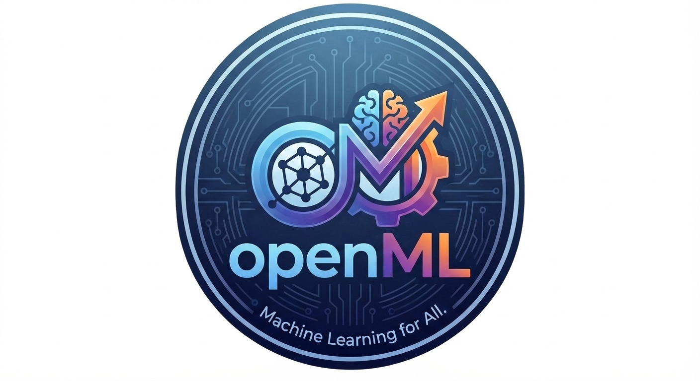

# openML

<div align="center">

**Browser-based Machine Learning Platform**

[English](#readme) | [한국어](#한국어) | [中文](#中文) | [日本語](#日本語) | [Español](#español)



A powerful, client-side machine learning platform that runs entirely in your browser. No server required, no data leaves your device.

[](https://opensource.org/licenses/MIT)
[](https://reactjs.org/)
[](https://www.typescriptlang.org/)
[](https://vitejs.dev/)

</div>

---

## 📖 Table of Contents

- [Features](#-features)
- [Supported Algorithms](#-supported-algorithms)
- [Getting Started](#-getting-started)
- [Project Structure](#-project-structure)
- [Technology Stack](#-technology-stack)
- [Development](#-development)
- [Deployment](#-deployment)
- [Contributing](#-contributing)
- [License](#-license)

---

## ✨ Features

### 🚀 Zero-Server Architecture
- **100% Client-Side**: All ML computations happen in your browser using Web Workers
- **Privacy First**: Your data never leaves your device
- **No Backend Required**: Deploy anywhere static hosting is available

### 📊 Data Processing
- **Multiple Formats**: Support for CSV, XLSX, and XLS files
- **Smart Type Detection**: Automatic numerical and categorical column detection
- **Data Preprocessing**: Missing value handling, normalization, filtering, and outlier removal
- **Correlation Analysis**: Pearson and Spearman correlation matrices with heatmaps

### 🤖 Machine Learning Algorithms
- **Supervised Learning**: Linear Regression, Logistic Regression, Random Forest, Neural Networks, XGBoost
- **Unsupervised Learning**: K-Means Clustering, PCA (Principal Component Analysis)
- **Model Evaluation**: Comprehensive metrics (Accuracy, Precision, Recall, F1, R², MSE, RMSE, MAE)

### 🎨 User Experience
- **Multi-Language Support**: English, Korean, Chinese, Japanese, Spanish
- **Dark/Light Theme**: Built-in theme switching
- **Interactive Visualizations**: Charts, scatter plots, heatmaps, and cluster visualizations
- **Real-time Progress**: Live training progress updates
- **Model Persistence**: Save and load trained models
- **Sample Datasets**: Try the platform without uploading your own data

---

## 🧠 Supported Algorithms

### Regression
| Algorithm | Description | Use Case |
|-----------|-------------|----------|
| **Multiple Linear Regression** | Predict continuous values using linear relationships | Housing prices, sales forecasting |
| **Random Forest (Regression)** | Ensemble of decision trees for robust predictions | Complex non-linear relationships |
| **XGBoost (Regression)** | Gradient boosting for high performance | Kaggle competitions, production ML |
| **Neural Networks (ANN)** | Deep learning with customizable architecture | Complex pattern recognition |

### Classification
| Algorithm | Description | Use Case |
|-----------|-------------|----------|
| **Logistic Regression** | Binary classification with probability estimation | Spam detection, churn prediction |
| **Random Forest (Classification)** | Ensemble method for robust classification | Customer segmentation |
| **XGBoost (Classification)** | Gradient boosting for high accuracy | Fraud detection, medical diagnosis |
| **Neural Networks (ANN)** | Deep learning for complex patterns | Image classification, NLP |

### Unsupervised Learning
| Algorithm | Description | Use Case |
|-----------|-------------|----------|
| **K-Means Clustering** | Partition data into k clusters | Customer segmentation, anomaly detection |
| **PCA** | Dimensionality reduction and anomaly detection | Feature extraction, visualization |

### Data Analysis
| Algorithm | Description | Use Case |
|-----------|-------------|----------|
| **Correlation Analysis** | Pearson & Spearman correlation matrices | Feature selection, data understanding |
| **Data Preprocessing** | Missing values, normalization, filtering | Data cleaning, preparation |

---

## 🚀 Getting Started

### Prerequisites

- Node.js 18+ 
- npm, yarn, or pnpm

### Installation

```bash
# Clone the repository
git clone https://github.com/yourusername/openml.git
cd openml

# Install dependencies
npm install
```

### Running Locally

```bash
# Start development server
npm run dev

# Build for production
npm run build

# Preview production build
npm run preview
```

### Quick Start

1. **Open the Application**: Navigate to `http://localhost:5173`
2. **Upload Data**: Drag & drop your CSV/XLSX file or try a sample dataset
3. **Preprocess**: Configure preprocessing options (optional)
4. **Train Models**: Select algorithms and train
5. **Analyze Results**: View metrics, visualizations, and export results

---

## 📁 Project Structure

```
openml/
├── public/
│   ├── samples/              # Sample datasets
│   └── workers/              # Web Workers for ML computations
│       ├── ann.worker.js      # Neural Network worker
│       ├── kmeans.worker.js  # K-Means worker
│       ├── logistic.worker.js # Logistic Regression worker
│       ├── pca.worker.js     # PCA worker
│       ├── regression.worker.js # Linear Regression worker
│       ├── rf.worker.js      # Random Forest worker
│       └── xgboost.worker.js  # XGBoost worker
├── src/
│   ├── components/
│   │   ├── charts/           # Chart components
│   │   ├── data/             # Data upload and preview
│   │   ├── layout/           # Layout components
│   │   ├── ml/               # ML-specific components
│   │   ├── seo/              # SEO components
│   │   ├── wizard/           # Wizard step components
│   │   │   ├── processing/   # Data processing panels
│   │   │   └── results/      # Model result details
│   ├── context/              # React Context providers
│   │   ├── DataContext.tsx   # Data state management
│   │   ├── LangContext.tsx   # Language state
│   │   ├── ThemeContext.tsx  # Theme state
│   │   └── WizardContext.tsx # Wizard state
│   ├── hooks/                # Custom React hooks
│   ├── i18n/                 # Internationalization
│   │   └── strings.ts        # Translation strings
│   ├── pages/                # Page components
│   │   └── wizard/           # Wizard step pages
│   └── utils/                # Utility functions
├── index.html
├── package.json
├── tsconfig.json
└── vite.config.ts
```

---

## 🛠 Technology Stack

### Frontend Framework
- **React 19.2** - UI library with modern hooks
- **TypeScript 5.9** - Type-safe development
- **Vite 7.3** - Fast build tool and dev server

### Styling
- **Tailwind CSS 4.1** - Utility-first CSS framework
- **Lucide React** - Beautiful icon library

### Machine Learning
- **TensorFlow.js 4.22** - Deep learning in browser
- **XGBoost JS 1.0** - Gradient boosting implementation
- **Custom Web Workers** - Pure JS implementations for RF, K-Means, PCA

### Data Processing
- **PapaParse 5.5** - CSV parsing
- **XLSX 0.18** - Excel file support

### Visualization
- **Chart.js 4.4** - Charting library
- **React Chart.js-2 5.3** - React wrapper for Chart.js
- **Recharts 3.7** - Composable charting components

### Routing
- **React Router DOM 7.6** - Client-side routing

---

## 💻 Development

### Available Scripts

```bash
npm run dev      # Start development server
npm run build    # Build for production
npm run preview  # Preview production build
npm run lint     # Run ESLint
```

### Architecture Overview

#### Web Worker Pattern
All ML computations run in separate Web Workers to prevent UI blocking:

```typescript
// Worker communication pattern
const worker = new Worker('/workers/regression.worker.js')
worker.postMessage({ type: 'RUN_REGRESSION', payload: config })
worker.onmessage = (e) => {
  if (e.data.type === 'RESULT') {
    // Handle result
  } else if (e.data.type === 'PROGRESS') {
    // Update progress
  }
}
```

#### Context Management
State is managed through React Context API:

- **DataContext**: Dataset, columns, and row data
- **WizardContext**: Step tracking, model selection, training results
- **LangContext**: Current language setting
- **ThemeContext**: Dark/light theme preference

#### Internationalization
Multi-language support through a centralized translation system:

```typescript
// Usage in components
import { t } from '@/i18n/strings'
import { useLang } from '@/context/LangContext'

const { lang } = useLang()
const text = t('welcomeTo', lang)
```

---

## 🌐 Deployment

### Static Hosting

The application can be deployed to any static hosting service:

#### Vercel
```bash
npm install -g vercel
vercel
```

#### Netlify
```bash
npm run build
# Upload dist/ folder
```

#### GitHub Pages
```bash
npm run build
# Deploy dist/ to gh-pages branch
```

### Environment Variables

No environment variables are required for basic functionality. All ML computations run client-side.

---

## 🤝 Contributing

Contributions are welcome! Please follow these steps:

1. Fork the repository
2. Create a feature branch (`git checkout -b feature/amazing-feature`)
3. Commit your changes (`git commit -m 'Add amazing feature'`)
4. Push to the branch (`git push origin feature/amazing-feature`)
5. Open a Pull Request

### Development Guidelines

- Follow the existing code style (TypeScript, functional components)
- Add tests for new features
- Update documentation as needed
- Ensure all languages are updated for UI changes

---

## 📄 License

This project is licensed under the MIT License - see the LICENSE file for details.

---

## 🙏 Acknowledgments

- **TensorFlow.js** team for the amazing browser ML library
- **XGBoost** for the powerful gradient boosting algorithm
- **Chart.js** and **Recharts** for excellent visualization tools
- **Vite** for the lightning-fast build tool

---

## 📞 Support

For issues, questions, or contributions:
- Open an issue on GitHub
- Check existing documentation
- Review the code examples in the repository

---

<div align="center">

**Made with ❤️ by the openML team**

[⬆ Back to Top](#openml)

</div>

---

## 한국어

<div align="center">

**브라우저 기반 머신러닝 플랫폼**

</div>

### ✨ 기능

#### 🚀 서버리스 아키텍처
- **100% 클라이언트 사이드**: 모든 ML 계산이 브라우저의 Web Workers에서 실행
- **프라이버시 우선**: 데이터가 기기를 떠나지 않음
- **백엔드 불필요**: 정적 호스팅이 가능한 곳이면 어디든 배포 가능

#### 📊 데이터 처리
- **다양한 형식 지원**: CSV, XLSX, XLS 파일 지원
- **스마트 타입 감지**: 수치형 및 범주형 컬럼 자동 감지
- **데이터 전처리**: 결측치 처리, 정규화, 필터링, 이상치 제거
- **상관관계 분석**: Pearson 및 Spearman 상관계수 행렬과 히트맵

#### 🤖 머신러닝 알고리즘
- **지도 학습**: 선형 회귀, 로지스틱 회귀, 랜덤 포레스트, 신경망, XGBoost
- **비지도 학습**: K-Means 클러스터링, PCA (주성분 분석)
- **모델 평가**: 포괄적인 메트릭 (정확도, 정밀도, 재현율, F1, R², MSE, RMSE, MAE)

#### 🎨 사용자 경험
- **다국어 지원**: 영어, 한국어, 중국어, 일본어, 스페인어
- **다크/라이트 테마**: 내장 테마 전환
- **대화형 시각화**: 차트, 산점도, 히트맵, 클러스터 시각화
- **실시간 진행률**: 실시간 학습 진행률 업데이트
- **모델 저장**: 학습된 모델 저장 및 로드
- **샘플 데이터셋**: 자체 데이터 업로드 없이 플랫폼 체험

### 🧠 지원 알고리즘

#### 회귀
| 알고리즘 | 설명 | 사용 사례 |
|---------|------|----------|
| **다중 선형 회귀** | 선형 관계를 사용하여 연속 값 예측 | 주택 가격, 매출 예측 |
| **랜덤 포레스트 (회귀)** | 강력한 예측을 위한 결정 트리 앙상블 | 복잡한 비선형 관계 |
| **XGBoost (회귀)** | 고성능을 위한 그래디언트 부스팅 | Kaggle 대회, 프로덕션 ML |
| **신경망 (ANN)** | 사용자 정의 아키텍처를 갖춘 딥러닝 | 복잡한 패턴 인식 |

#### 분류
| 알고리즘 | 설명 | 사용 사례 |
|---------|------|----------|
| **로지스틱 회귀** | 확률 추정을 통한 이진 분류 | 스팸 감지, 이탈 예측 |
| **랜덤 포레스트 (분류)** | 강력한 분류를 위한 앙상블 방법 | 고객 세분화 |
| **XGBoost (분류)** | 높은 정확도를 위한 그래디언트 부스팅 | 사기 감지, 의료 진단 |
| **신경망 (ANN)** | 복잡한 패턴을 위한 딥러닝 | 이미지 분류, NLP |

#### 비지도 학습
| 알고리즘 | 설명 | 사용 사례 |
|---------|------|----------|
| **K-Means 클러스터링** | 데이터를 k개 클러스터로 분할 | 고객 세분화, 이상치 감지 |
| **PCA** | 차원 축소 및 이상치 감지 | 특성 추출, 시각화 |

### 🚀 시작하기

#### 설치

```bash
# 저장소 복제
git clone https://github.com/yourusername/openml.git
cd openml

# 의존성 설치
npm install
```

#### 로컬 실행

```bash
# 개발 서버 시작
npm run dev

# 프로덕션 빌드
npm run build

# 프로덕션 빌드 미리보기
npm run preview
```

### 📄 라이선스

이 프로젝트는 MIT 라이선스 하에 라이선스가 부여됩니다.

---

## 中文

<div align="center">

**基于浏览器的机器学习平台**

</div>

### ✨ 功能

#### 🚀 零服务器架构
- **100% 客户端**：所有 ML 计算都在浏览器中使用 Web Workers 运行
- **隐私优先**：您的数据永远不会离开您的设备
- **无需后端**：可以在任何支持静态托管的地方部署

#### 📊 数据处理
- **多种格式**：支持 CSV、XLSX 和 XLS 文件
- **智能类型检测**：自动检测数值和分类列
- **数据预处理**：缺失值处理、归一化、过滤和异常值去除
- **相关性分析**：Pearson 和 Spearman 相关矩阵及热图

#### 🤖 机器学习算法
- **监督学习**：线性回归、逻辑回归、随机森林、神经网络、XGBoost
- **无监督学习**：K-Means 聚类、PCA（主成分分析）
- **模型评估**：全面的指标（准确率、精确率、召回率、F1、R²、MSE、RMSE、MAE）

#### 🎨 用户体验
- **多语言支持**：英语、韩语、中文、日语、西班牙语
- **深色/浅色主题**：内置主题切换
- **交互式可视化**：图表、散点图、热图和聚类可视化
- **实时进度**：实时训练进度更新
- **模型持久化**：保存和加载训练好的模型
- **示例数据集**：无需上传自己的数据即可试用平台

### 🧠 支持的算法

#### 回归
| 算法 | 描述 | 用例 |
|------|------|------|
| **多元线性回归** | 使用线性关系预测连续值 | 房价预测、销售预测 |
| **随机森林（回归）** | 决策树集成以进行稳健预测 | 复杂的非线性关系 |
| **XGBoost（回归）** | 高性能的梯度提升 | Kaggle 竞赛、生产 ML |
| **神经网络（ANN）** | 具有可定制架构的深度学习 | 复杂的模式识别 |

#### 分类
| 算法 | 描述 | 用例 |
|------|------|------|
| **逻辑回归** | 带概率估计的二分类 | 垃圾邮件检测、流失预测 |
| **随机森林（分类）** | 用于稳健分类的集成方法 | 客户细分 |
| **XGBoost（分类）** | 高准确度的梯度提升 | 欺诈检测、医疗诊断 |
| **神经网络（ANN）** | 用于复杂模式的深度学习 | 图像分类、NLP |

#### 无监督学习
| 算法 | 描述 | 用例 |
|------|------|------|
| **K-Means 聚类** | 将数据划分为 k 个簇 | 客户细分、异常检测 |
| **PCA** | 降维和异常检测 | 特征提取、可视化 |

### 🚀 快速开始

#### 安装

```bash
# 克隆仓库
git clone https://github.com/yourusername/openml.git
cd openml

# 安装依赖
npm install
```

#### 本地运行

```bash
# 启动开发服务器
npm run dev

# 构建生产版本
npm run build

# 预览生产构建
npm run preview
```

### 📄 许可证

本项目采用 MIT 许可证 - 详见 LICENSE 文件。

---

## 日本語

<div align="center">

**ブラウザベースの機械学習プラットフォーム**

</div>

### ✨ 機能

#### 🚀 ゼロサーバーアーキテクチャ
- **100% クライアントサイド**：すべてのML計算はブラウザのWeb Workersで実行
- **プライバシー優先**：データがデバイスから漏洩しない
- **バックエンド不要**：静的ホスティングが可能な場所ならどこでもデプロイ可能

#### 📊 データ処理
- **複数のフォーマット**：CSV、XLSX、XLSファイルをサポート
- **スマートタイプ検出**：数値列とカテゴリ列の自動検出
- **データ前処理**：欠損値処理、正規化、フィルタリング、外れ値除去
- **相関分析**：PearsonおよびSpearman相関行列とヒートマップ

#### 🤖 機械学習アルゴリズム
- **教師あり学習**：線形回帰、ロジスティック回帰、ランダムフォレスト、ニューラルネットワーク、XGBoost
- **教師なし学習**：K-Meansクラスタリング、PCA（主成分分析）
- **モデル評価**：包括的な指標（精度、適合率、再現率、F1、R²、MSE、RMSE、MAE）

#### 🎨 ユーザーエクスペリエンス
- **多言語サポート**：英語、韓国語、中国語、日本語、スペイン語
- **ダーク/ライトテーマ**：内蔵テーマ切り替え
- **インタラクティブな可視化**：チャート、散布図、ヒートマップ、クラスタ可視化
- **リアルタイム進捗**：リアルタイムのトレーニング進捗更新
- **モデル永続化**：トレーニング済みモデルの保存と読み込み
- **サンプルデータセット**：独自のデータをアップロードせずにプラットフォームを試用

### 🧠 サポートされているアルゴリズム

#### 回帰
| アルゴリズム | 説明 | 使用例 |
|------------|------|------|
| **重回帰** | 線形関係を使用して連続値を予測 | 住宅価格、売上予測 |
| **ランダムフォレスト（回帰）** | 堅牢な予測のための決定木アンサンブル | 複雑な非線形関係 |
| **XGBoost（回帰）** | 高性能の勾配ブースティング | Kaggleコンペティション、本番ML |
| **ニューラルネットワーク（ANN）** | カスタマイズ可能なアーキテクチャを持つディープラーニング | 複雑なパターン認識 |

#### 分類
| アルゴリズム | 説明 | 使用例 |
|------------|------|------|
| **ロジスティック回帰** | 確率推定による2値分類 | スパム検出、解約予測 |
| **ランダムフォレスト（分類）** | 堅牢な分類のためのアンサンブル手法 | 顧客セグメンテーション |
| **XGBoost（分類）** | 高精度の勾配ブースティング | 詐欺検出、医療診断 |
| **ニューラルネットワーク（ANN）** | 複雑なパターンのためのディープラーニング | 画像分類、NLP |

#### 教師なし学習
| アルゴリズム | 説明 | 使用例 |
|------------|------|------|
| **K-Meansクラスタリング** | データをk個のクラスタに分割 | 顧客セグメンテーション、異常検知 |
| **PCA** | 次元削減と異常検知 | 特徴抽出、可視化 |

### 🚀 始め方

#### インストール

```bash
# リポジトリをクローン
git clone https://github.com/yourusername/openml.git
cd openml

# 依存関係をインストール
npm install
```

#### ローカルで実行

```bash
# 開発サーバーを開始
npm run dev

# 本番用にビルド
npm run build

# 本番ビルドをプレビュー
npm run preview
```

### 📄 ライセンス

このプロジェクトはMITライセンスの下でライセンスされています。

---

## Español

<div align="center">

**Plataforma de Aprendizaje Automático Basada en Navegador**

</div>

### ✨ Características

#### 🚀 Arquitectura Sin Servidor
- **100% del Lado del Cliente**: Todos los cálculos de ML se ejecutan en su navegador usando Web Workers
- **Privacidad Primero**: Sus datos nunca abandonan su dispositivo
- **Sin Backend Requerido**: Implemente en cualquier lugar donde esté disponible el alojamiento estático

#### 📊 Procesamiento de Datos
- **Múltiples Formatos**: Soporte para archivos CSV, XLSX y XLS
- **Detección Inteligente de Tipos**: Detección automática de columnas numéricas y categóricas
- **Preprocesamiento de Datos**: Manejo de valores faltantes, normalización, filtrado y eliminación de outliers
- **Análisis de Correlación**: Matrices de correlación Pearson y Spearman con mapas de calor

#### 🤖 Algoritmos de Aprendizaje Automático
- **Aprendizaje Supervisado**: Regresión Lineal, Regresión Logística, Random Forest, Redes Neuronales, XGBoost
- **Aprendizaje No Supervisado**: K-Means Clustering, PCA (Análisis de Componentes Principales)
- **Evaluación de Modelos**: Métricas completas (Precisión, Precisión, Recall, F1, R², MSE, RMSE, MAE)

#### 🎨 Experiencia de Usuario
- **Soporte Multilingüe**: Inglés, coreano, chino, japonés, español
- **Tema Oscuro/Claro**: Cambio de tema integrado
- **Visualizaciones Interactivas**: Gráficos, diagramas de dispersión, mapas de calor y visualizaciones de clústeres
- **Progreso en Tiempo Real**: Actualizaciones en vivo del progreso de entrenamiento
- **Persistencia de Modelos**: Guardar y cargar modelos entrenados
- **Conjuntos de Datos de Muestra**: Pruebe la plataforma sin cargar sus propios datos

### 🧠 Algoritmos Soportados

#### Regresión
| Algoritmo | Descripción | Caso de Uso |
|-----------|-------------|-------------|
| **Regresión Lineal Múltiple** | Predecir valores continuos usando relaciones lineales | Precios de viviendas, pronósticos de ventas |
| **Random Forest (Regresión)** | Conjunto de árboles de decisión para predicciones robustas | Relaciones no lineales complejas |
| **XGBoost (Regresión)** | Gradient boosting para alto rendimiento | Competencias Kaggle, ML en producción |
| **Redes Neuronales (ANN)** | Deep learning con arquitectura personalizable | Reconocimiento de patrones complejos |

#### Clasificación
| Algoritmo | Descripción | Caso de Uso |
|-----------|-------------|-------------|
| **Regresión Logística** | Clasificación binaria con estimación de probabilidad | Detección de spam, predicción de abandono |
| **Random Forest (Clasificación)** | Método de conjunto para clasificación robusta | Segmentación de clientes |
| **XGBoost (Clasificación)** | Gradient boosting para alta precisión | Detección de fraude, diagnóstico médico |
| **Redes Neuronales (ANN)** | Deep learning para patrones complejos | Clasificación de imágenes, NLP |

#### Aprendizaje No Supervisado
| Algoritmo | Descripción | Caso de Uso |
|-----------|-------------|-------------|
| **K-Means Clustering** | Particionar datos en k clústeres | Segmentación de clientes, detección de anomalías |
| **PCA** | Reducción de dimensionalidad y detección de anomalías | Extracción de características, visualización |

### 🚀 Comenzando

#### Instalación

```bash
# Clonar el repositorio
git clone https://github.com/yourusername/openml.git
cd openml

# Instalar dependencias
npm install
```

#### Ejecutar Localmente

```bash
# Iniciar servidor de desarrollo
npm run dev

# Construir para producción
npm run build

# Previsualizar construcción de producción
npm run preview
```

### 📄 Licencia

Este proyecto está licenciado bajo la Licencia MIT - consulte el archivo LICENSE para más detalles.
